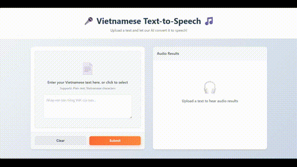

# 🗣️ Vietnamese Text-to-Speech (TTS) + Correction

An end-to-end **Vietnamese Text-to-Speech system** with integrated **text correction** capabilities. 

This project provides:

* ⚡ **Backend API (FastAPI)** – Text correction & TTS endpoints
* 🎨 **Frontend (Next.js)** – Real-time web interface to input text and play audio
* 📦 **Docker/Docker Compose** – Easy local deployment

<div align="center">
  <a href="https://www.youtube.com/watch?v=uFUVJh0nECE" target="_blank">
    
  </a>
  <p><b>Click to watch the full demo on YouTube</b></p>
</div>

---

### 📂 Project Structure

```
text_to_speech/
├── backend/                       # Backend (FastAPI + text correction & TTS)
│   ├── app.py                     # FastAPI server (/correction, /tts)
│   ├── src/
│   │   ├── __init__.py
│   │   ├── correction.py          # Text correction module
│   │   ├── tts.py                 # TTS processing module
│   │   └── utils.py               # Helpers (logging, preprocessing)
│   ├── assets/                    # Model files & generated audio
│   ├── requirements.txt           # Python dependencies
│   └── Dockerfile                 # Backend container
│
├── frontend/                       # Frontend (Next.js UI)
│   ├── pages/
│   │   └── index.js               # Main app page (text input + audio)
│   ├── components/                # Reusable React components
│   │   ├── TextInput.js
│   │   └── AudioPlayer.js
│   ├── styles/                     # CSS modules
│   ├── .env.example
│   ├── package.json
│   └── Dockerfile                 # Frontend container
│
├── docker-compose.yaml             # Orchestrates backend + frontend
├── README.md                       # This file
└── .gitignore
```

---

### 🔧 Requirements

* **Python** 3.10+
* **Node.js** 18+
* *(Optional)* Docker 24+ & Docker Compose v2

---

### 🚀 Quick Start (without Docker)

* **Backend API**
    ```bash
    cd text_to_speech/backend

    python -m venv .venv
    # Linux/macOS: source .venv/bin/activate
    # Windows: .\.venv\Scripts\activate

    pip install -r requirements.txt

    uvicorn app:app --host 0.0.0.0 --port 8000 --reload
    ```

* **Frontend UI**
    ```bash
    cd text_to_speech/frontend

    npm install
    cp .env.example .env    # Windows: copy .env.example .env

    export NEXT_PUBLIC_API_URL=http://localhost:8000
    # Windows PowerShell: $env:NEXT_PUBLIC_API_URL="http://localhost:8000"

    npm run dev
    ```

Open **[http://localhost:3000](http://localhost:3000)** → enter Vietnamese text → get corrected text & play audio.

---

### 🐳 Run with Docker Compose

```bash
cd text_to_speech
docker compose up -d --build
```

* Backend → [http://localhost:8000](http://localhost:8000)
* Frontend → [http://localhost:3000](http://localhost:3000)

> `NEXT_PUBLIC_API_URL` is configured in `docker-compose.yaml`.

---

### 📡 API Endpoints

**POST `/correction`** – Correct Vietnamese text

* **Request**:

```json
{
  "text": "Toi dang hoc AI"
}
```

* **Response**:

```json
{
  "corrected": "Tôi đang học AI"
}
```

---

**POST `/tts`** – Convert text to speech

* **Form-data**: `text`
* **Response**: WAV audio file

```bash
curl -X POST "http://localhost:8000/tts" \
     -F "text=Tôi đang học AI" \
     --output output.wav
```

---


### 📝 Features

* **Text Correction** – Auto fix typos, missing diacritics, & incorrect words
* **Vietnamese TTS** – Natural-sounding speech with correct intonation
* **Web Interface** – Real-time input, audio playback, example texts

---

### 🔧 Configuration

* **Backend**: `PYTHONUNBUFFERED=1`
* **Frontend**: `NEXT_PUBLIC_API_URL=http://localhost:8000`
* **Ports**: Backend 8000, Frontend 3000

---

### 🙏 Acknowledgments

* [VietTTS](https://github.com/NTT123/vietTTS)
* [bmd1905/vietnamese-correction-v2](https://huggingface.co/bmd1905/vietnamese-correction-v2)
* FastAPI & Next.js communities

